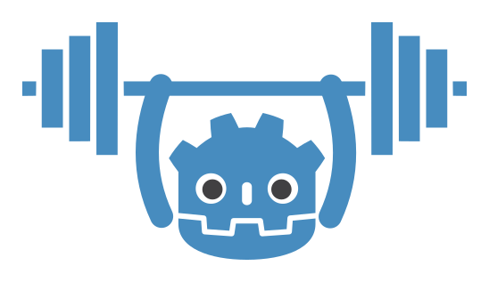

# GodotAIGym



Make your Godot project into OpenAI Gym environment to train RL models with PyTorch. This project only runs on Linux systems.

## Requirements
1. Godot Engine version >= 3.2 compiled from source
2. Boost interprocess (apt install libboost-container-dev libboost-system-dev libboost-locale-dev)
3. Pytorch version >= 1.5
4. OpenAI Gym
4. Python setuptools


## Installation
First, in **setup.py** change the variable **GODOT_PATH** to the root directory of godot engine source. Then run:
```bash
python setup.py
```
This script does several things:
1. Downloads libtorch cpu only version, unpacks it
2. Copies **GodotSharedMemory** module and compiles standard godot editor (x11 platform).
3. Compiles x11 export template, dev tools and server templates
4. Installs python module **GodotEnv** that is used to communicate with the engine.

## Docs
[InvPendulum](https://lupoglaz.github.io/GodotAIGym/tutorial_basic.html)
tutorial shows how to make an environment, speed up its execution, train a model and deploy back to the engine.

[API](https://lupoglaz.github.io/GodotAIGym/API.html) lists classes and function in python and godot.

# TODO
Resolve the bug: 
```bash
handle_crash: Program crashed with signal 11
Dumping the backtrace. Please include this when reporting the bug on https://github.com/godotengine/godot/issues
[1] /lib/x86_64-linux-gnu/libc.so.6(+0x46210) [0x7f79ead5a210] (??:0)
[2] ./InvPendulum.x86_64() [0x812e16] (/usr/include/c++/9/bits/basic_string.h:2301)
[3] ./InvPendulum.x86_64() [0x63942e] (/home/lupoglaz/Projects/godot/./core/os/memory.h:119)
```


